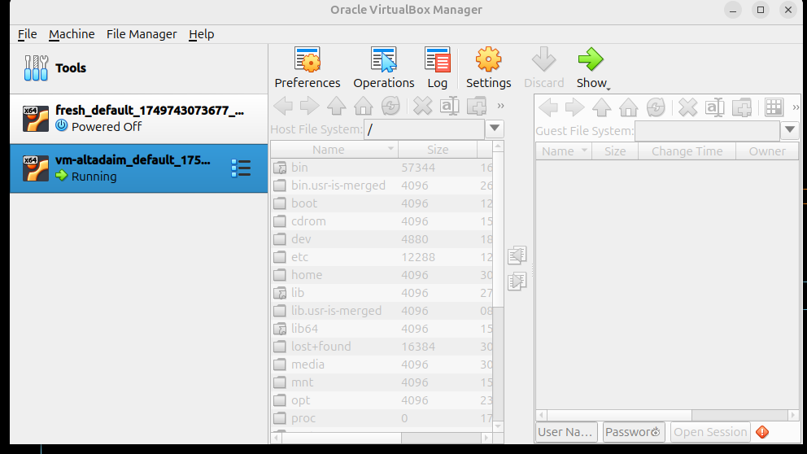

# How to test Altadaim in a virtual machine

This section explains how to set up a virtual machine to test Altadaim
using VirtualBox and Vagrant.

- Vagrant lets you specify & manage virtual Linux distributions.
- VirtualBox lets you run virtual machines.

## Prepare your setup

- First, update your system packages: `sudo apt update && sudo apt upgrade`
- Install VirtualBox: Download the version for Ubuntu 24.04 from [https://www.virtualbox.org/wiki/Linux_Downloads](https://www.virtualbox.org/wiki/Linux_Downloads)
- Install the latest Vagrant version:

``` bash
wget -O - https://apt.releases.hashicorp.com/gpg | sudo gpg --dearmor -o /usr/share/keyrings/hashicorp-archive-keyring.gpg
echo "deb [arch=$(dpkg --print-architecture) signed-by=/usr/share/keyrings/hashicorp-archive-keyring.gpg] https://apt.releases.hashicorp.com $(grep -oP '(?<=UBUNTU_CODENAME=).*' /etc/os-release || lsb_release -cs) main" | sudo tee /etc/apt/sources.list.d/hashicorp.list
sudo apt update && sudo apt install vagrant
```

## Run Altadaim in your Virtual Machine (VM)

- Create a directory for your VM & initialise git:
  `mkdir ~/vm-altadaim && cd ~/vm-altadaim && git init`
- Create a `Vagrantfile` with Ubuntu 24.04:
  `vagrant init bento/ubuntu-24.04 --box-version 202502.21.0`
- Files in the project directory (the same directory where the `Vagrantfile` sits)
  are automatically accessible in the VM at `/vagrant`.
  - Copy Altadaim's install script to the project directory:
    `wget https://raw.githubusercontent.com/khaldoun-xyz/altadaim/main/install_altadaim.sh`
- Start your VM with `vagrant up --provider=virtualbox`
- Connect to your VM: `vagrant ssh`
- Navigate to the `/vagrant` directory: `cd /vagrant`
- Run the install script: `sudo bash install_altadaim.sh`

### Use VirtualBox VM

- Once the install command has been successfully executed in your terminal,
  open your Oracle VirtualBox Manager.
- Your Virtual Machine (VM) should now display a **"Running"** status.
  To make the VM's graphical interface visible,
  click on the **"Show"** button within the VirtualBox Manager window.
- Here's an example of what a running VM looks like in the VirtualBox Manager:



#### Accessing your VM

- To log in and access your VM, you will typically need the following credentials:
  - Username: `vagrant`
  - Password: `vagrant`
  - Note: These are the default credentials if you have
    not changed them during the setup process.

#### Basic VM demonstration

- This short video demonstrates a basic operation within an "Altadaim" Virtual Machine:
  [Watch the Altadaim VM Demonstration Here](https://www.loom.com/share/2db65f3ce37543589a6ce449e25431f0?sid=a37d8fcb-6b9e-4629-bb90-6ff9f4a73f1d)
  
## Error log

- If you encounter errors, you might find help here: [potential errors](/docs/potential_errors.md)
